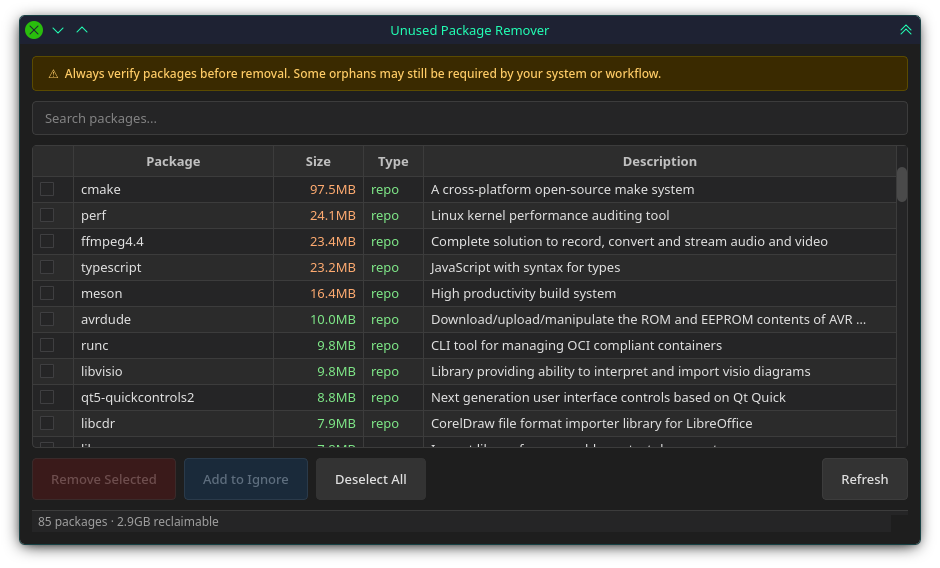

# unused-pkg-remover

A PySide6 GUI tool to find and remove orphaned Arch Linux packages. Orphans
detected by `pacman -Qtdq` are displayed sorted by installed size with repo/AUR
markers, selective removal via `pkexec`, and a built-in safe list.



## Features

- **Orphan scan** via `pacman -Qtdq`, enriched with size and description via `expac`
- **No-deps mode** (`--no-deps`) skips dependency checks and forces package removal using `pacman -Rns --nodeps`
- **Dry run** mode (`--dry-run`) shows what would be removed without executing
- **Search bar** to filter packages by name as you type
- **Dependency check** — warns if selected packages are required by others (via `pactree` or `pacman -Qi`)
- Sorted by installed size (largest first)
- AUR vs. repo package markers (red/green)
- Color-coded size column (red > 100 MB, orange > 10 MB, green otherwise)
- Built-in safe list of ~100 critical system packages (never shown)
- Select packages via checkboxes, remove with `pkexec pacman -Rns`
- Confirmation dialog showing package names, sizes, dependents, and total reclaimable space
- Progress dialog during removal
- Add packages to ignore list directly from the UI
- Ignore files: `~/.unused-ignore`, `~/.config/unused-pkg-remover/ignore`, `./.unused-ignore`
- Window geometry remembered between sessions via `QSettings`
- Dark theme UI (Fusion style with custom QPalette and stylesheet)

## Requirements

- Python 3.11+
- PySide6 >= 6.5
- `pacman`, `expac`, `pkexec`
- Arch Linux (or derivative with compatible package tools)

## Installation

### pip (recommended)

```bash
pip install .
```

This installs the `unused-pkg-remover` command:

```bash
unused-pkg-remover
```

### Direct

```bash
python3 main.py
```

## CLI Options

| Flag | Description |
|---|---|
| `--dry-run` | Show what would be removed without actually removing |
| `--no-deps` | Skip dependency checks and force removal of packages |

```bash
unused-pkg-remover --dry-run --no-deps
```

## Ignore List

Packages can be excluded from results by adding them to any of these files:

- `~/.unused-ignore`
- `~/.config/unused-pkg-remover/ignore`
- `./.unused-ignore` (project-local)

One package name per line. Lines starting with `#` are ignored.

```text
# manually installed AUR helper
paru
yay
# custom kernel modules
nvidia
```

Packages can also be added to `./.unused-ignore` directly from the GUI via the
**Add to Ignore** button.

## How It Works

### Orphan Detection

The tool scans for orphaned packages using `pacman -Qtdq` — packages that were
installed as dependencies but are no longer required by any explicitly installed
package. Results are enriched with installed size and description via `expac`.

A built-in safe list of ~100 critical system packages (`scanner.py:26`) is always
excluded. Additional packages can be excluded via ignore files (see [Ignore List](#ignore-list)).

### Dependency Check

Before removal, the tool checks whether any *other* installed packages depend on
your selected packages using `pactree -r -u` (reverse unique tree). If `pactree`
is unavailable, it falls back to parsing `pacman -Qi` output.

If dependents are found, a warning is shown in the confirmation dialog listing
each package and what depends on it:

```
Some packages are required by others:
  libfoo ← firefox, thunderbird

Removing them may break dependent packages.
```

This is a **warning only** — it does not block removal. The decision is yours.

### Removal Flow

1. **Normal removal** — Selected packages are removed with `pkexec pacman -Rns --noconfirm`.
   The `-s` flag recursively removes unneeded dependencies of the target packages.
2. **Dependency conflict** — If pacman refuses because other installed packages
   depend on the removal targets (common with `-s` recursion), a dialog appears
   with a **Force Remove (--nodeps)** button.
3. **Force removal** — Clicking it re-runs the removal with `--nodeps`, which
   tells pacman to skip all dependency checks. This can break dependent packages.

### CLI `--no-deps` Flag

Passing `--no-deps` from the command line skips the dialog entirely and uses
`--nodeps` from the start:

```bash
unused-pkg-remover --no-deps
```

This is useful when you already know the packages can be safely removed despite
dependency warnings.

## Safe List

The tool has a built-in safe list of ~100 packages (`scanner.py:26`) that are
never shown — critical system packages like `glibc`, `systemd`, `linux-firmware`,
`pacman`, `grub`, `openssh`, and similar. This list is a safety net; use the
ignore files for user-specific exclusions.

## Project

```
unused-pkg-remover/
├── main.py                    # Entry point shim
├── pyproject.toml             # Package metadata & CLI entry point
├── unused_pkg_remover/
│   ├── __init__.py
│   ├── main.py                # Display check & GUI launcher
│   ├── gui.py                 # Qt6 window, table, theme, removal logic
│   └── scanner.py             # Orphan detection, ignore/safe filtering, AUR detection
└── README.md
```
